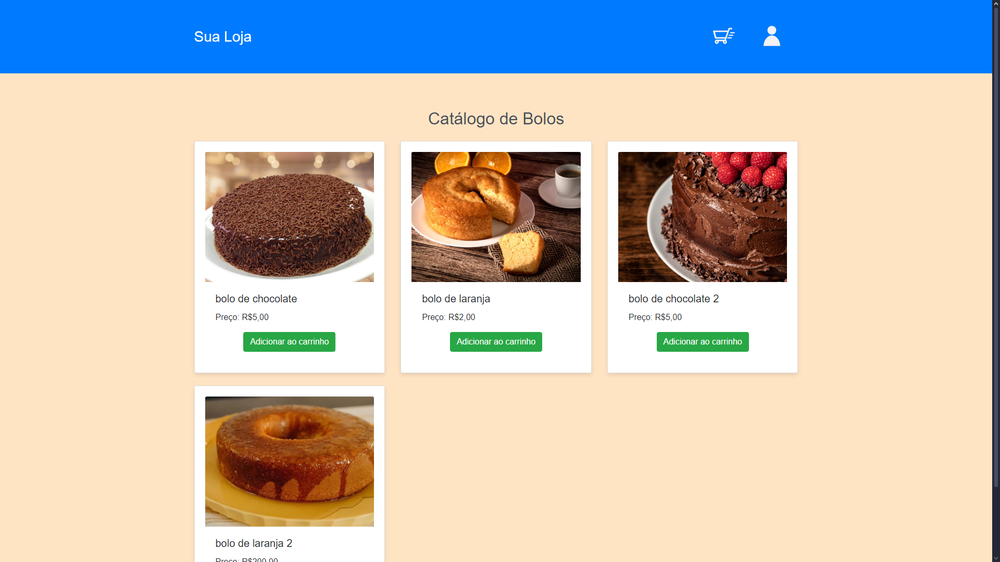
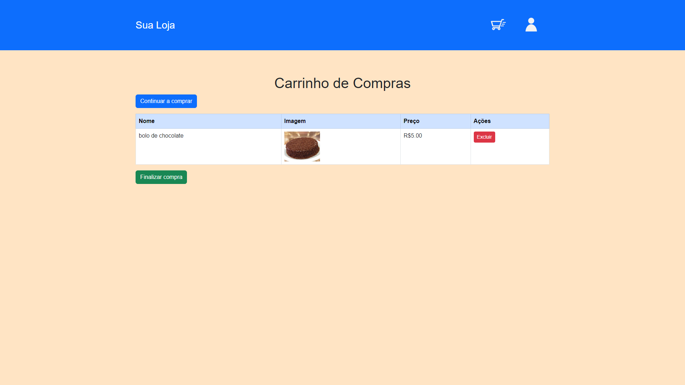
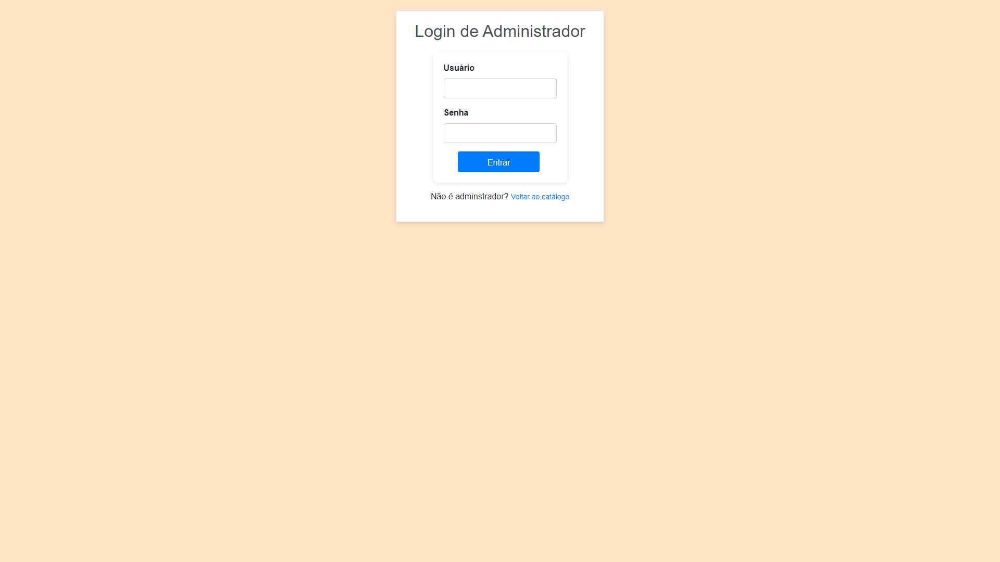
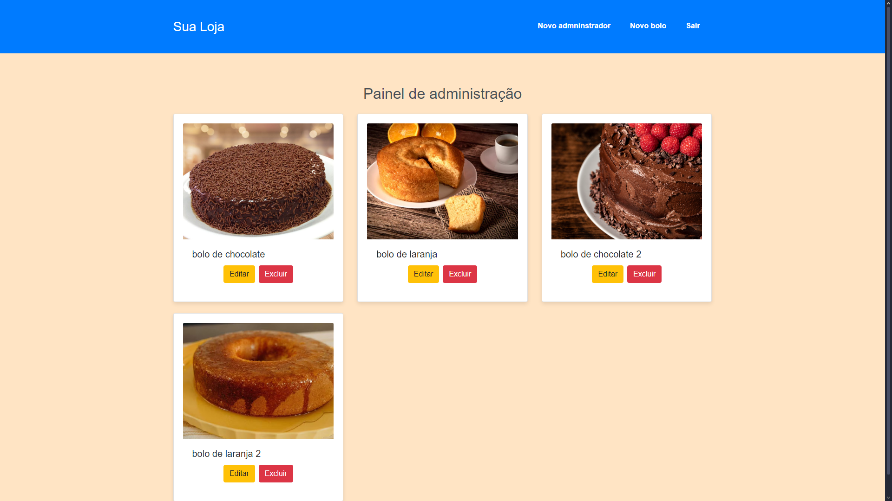
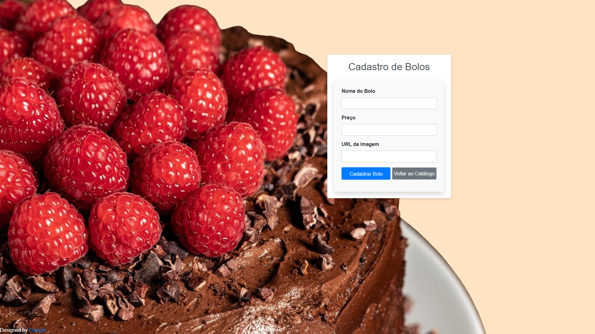

# Catálogo de Bolos

Projeto realizado pra avaliação na matédeia de desenvolvimento fullstack

## Conteúdo

- [Geral](#geral)
  - [Screenshots](#screenshots)
- [Meu processo](#meu-processo)
  - [Feito com](#feito-com)
  - [O que aprendi](#o-que-aprendi)
  - [A melhorar](#a-melhorar)

## Geral

Para começar, abra o arquivo Cake_catalog.sql e execute o script para criar o banco de dados e as tabelas corretamente.

Após isso, vá no arquivo db.php e coloque a senha para seu usuário mySQL, caso necessário, mude o nome de usuário também

Após isso, no Xampp, inicie os servidores apache e mySQL.

Acesse o localhost no diretório da pasta catalogo_bolos, para acessar a página de admin, pode abrir diretamente no diretório ou usar o admin "Fulano" com a senha 123

A usuário comum pode comprar bolos adicionando-os ao carrinho de compras. Na página do carrinho de compras o usuário pode excluir itens dele e comprar, a compra apenas deleta os itens da tabela "cart" e manda um mensagem

O administrador pode adicionar novos bolos e administradores, assim como excluir e editar bolos existentes

### Screenshots

Página inicial

Carrinho de compras

Página de login

Painel do admnistrador

Cadastro de novo funcionário

Cadastro de novo bolo

## Meu processo

### feito com

- PHP
- mySQL
- HTML5
- Bootstrap
- CSS3
- JavaScrip

### O que aprendi

Aprendi como utilizar o PHP para manipular um banco de dados PHP

### A melhorar

Melhorar prática de PHP para perceber erros mais rápido e com maior eficiência
